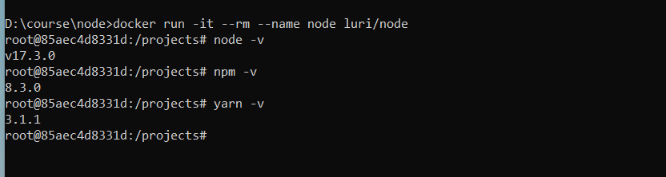
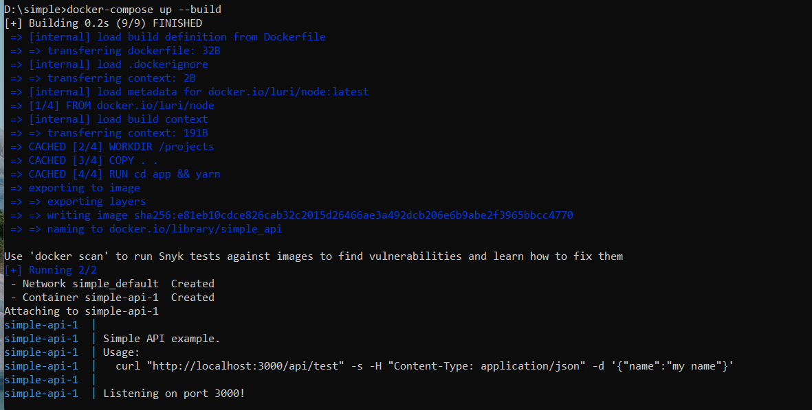

# Nodejs Dockerfile

Nodejs Docker

A minimal Dockerfile based on lates stable Node.js with Git installed.

## What's included

- NVM v0.39.1
- latest stable node
- yarn and npm
- Git


USAGE:

```bash
docker run -it --rm --name node -v "$PWD":/projects luri/node
```



## Example

See folder "examples". There is an example of using this simple docker in a node js application.

You can build and run with:

```bash
docker build . -t example
# then
docker run -it --rm --name node example
```

If you want to use docker-compose, then

```bash
docker-compose up --build
```



### Testing

```bash
 curl "http://localhost:3000/api/test" -s -H "Content-Type: application/json" -d '{"name":"my name"}'
```

Result:

```json
{"code":0,"body":{"name":"my name"},"text":"POST success"}
```

### Resource

- [Nodejs Docker Repository](https://hub.docker.com/repository/docker/luri/node)


---

Built by (c) Luri Darmawan and contributors. Released under the MIT license.
